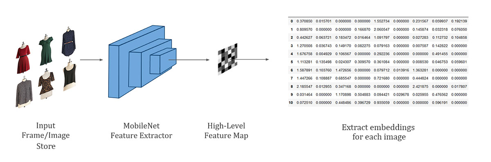
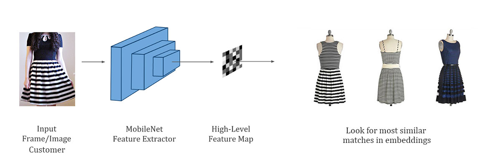
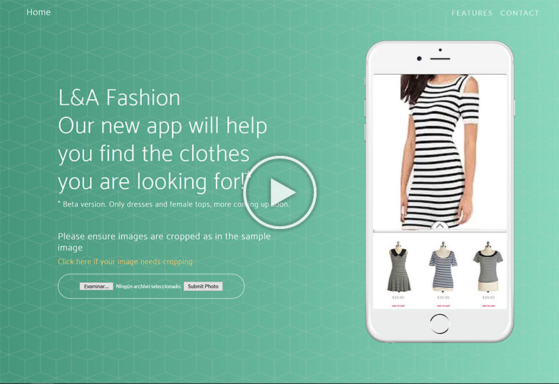

# Final project of the Master in Data Science

This project has been developed by [Antonio Ramos](https://github.com/antonioramos1/) and [Lorenzo Chavez](https://github.com/LorenzoChavez).

*Master in Data Science - [KSchool](https://kschool.com/) Madrid*

### Business case
The Fashion industry is changing. Online stores have more and more clothing items making it more challenging to customers to find the clothes they really want. On the other hand, with the increasing influence of social media platforms there is a strong demand from people to find a specific item that may be appealing to them.

This project will try to offer a solution to these problems by allowing customers to have recommendations of products they may be interested to purchase based on an image they have previously provided.

### Project overview
-   Coded in Python3
-   Using Keras to extract feature representations from images.
-   Image retrieval algorithm to select "k" most similar images.
-   Flask-based web application powered by Keras to put the final algorithm in production and replicate the business case.

On the images below you can see a summary of the project flow.  

**Store: creating database**

**Customer: clothing recommendation**

### Demo
We have also recorded a quick video demo. Check it out by clicking on the image below:

If you are interested in replicating this project please follow the steps on the [TFM-Report](./tfm-documents/tfm-report.pdf) document.

**Credit to dataset owners and paper:**

_M. Hadi Kiapour, Xufeng Han, Svetlana Lazebnik, Alexander C. Berg, Tamara L. Berg. Where to Buy It: Matching Street Clothing Photos in Online Shops. International Conference on Computer Vision (ICCV), 2015._

For any questions please feel free to contact us at: lorenzo.cht@gmail.com and antonioramosglz@gmail.com
